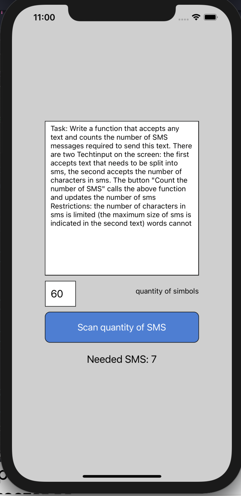

  <a href="#-technologies">Technologies</a>&nbsp;&nbsp;&nbsp;|&nbsp;&nbsp;&nbsp;
  <a href="#-projeto"> About The Project</a>&nbsp;&nbsp;&nbsp;|&nbsp;&nbsp;&nbsp;
  <a href="#memo-licence">Licence</a>

 

  

## 🚀 Tecnologias

This project was developed with folowing technologies:

- [Node.js](https://nodejs.org/en/)
- [React Native](https://facebook.github.io/react-native/)
- [Expo](https://expo.io/)
- [TypeScript](https://www.typescriptlang.org/)

## 💻 Project

SMS Counter is an application that counts the number of characters needed to send a message and set the limit of characters to be sent in one message and calculate how many message is needed to send for one text message.

## :memo: Licence
This project is licenced by MIT. Check the licence file [LICENSE](LICENSE.md) for more details
---
<<<<<<< HEAD
Made by ♥ Horacio Sapato 
